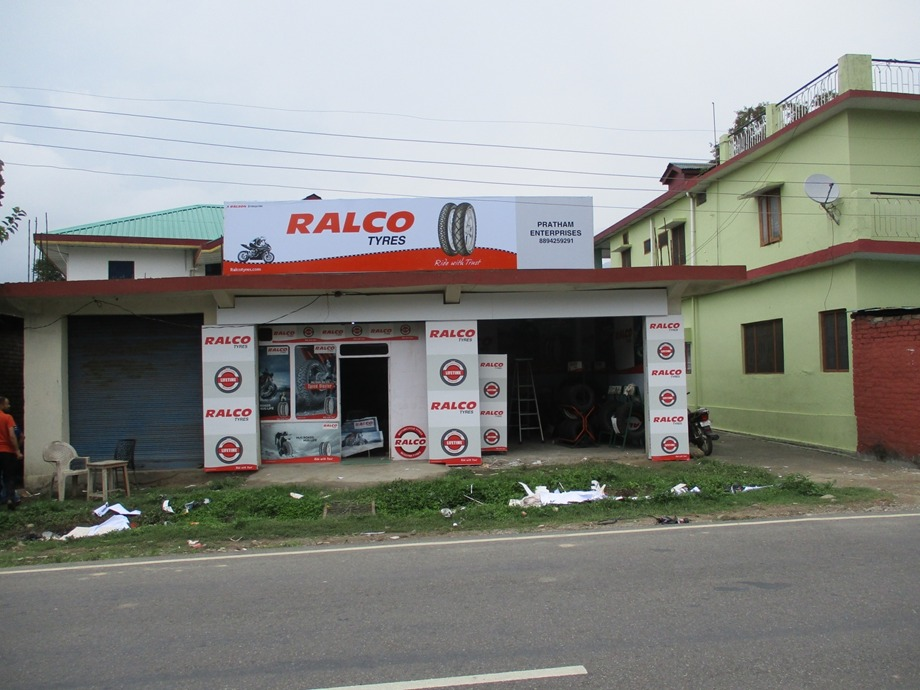

## Ralco Shopee Project in Bihar

As you are aware, Ralco has not been able to create a grasp on the auto-tyre (two and three wheeler) market in Bihar. Both the company and us have been working hard to increase the share of the market that buys from Ralco. Lately, we have been surveying and communicating with the shopkeepers and buyers. The results of these conversations indicate that we might need to restrategize our plan in Bihar.

The problem we face is that the in the two and three-wheeler market, there are large corporate houses like [INSERT NAMES HERE] that have huge marketing operations in Bihar. Bihar is one of the biggest markets for two and three-wheelers as they are still the primary mode of transport. We are not being able to create a huge impact on the urban markets like Patna and Muzaffarpur where the branding of these large companies is very strong. The market is very saturated in these urban areas. But what we observed was that none of these companies have invested heavily in marketing themselves to the rural areas. We think that there is an opportunity there as people are buying more and more two wheelers in these areas.

In coming up with ways to enter a heavily saturated market, we took inspiration from Airtel. At a time when the market was saturated with large telecom providers, Airtel recognized that most of the companies were focusing on the urban market. They went a different way and marketed the Airtel brand in rural areas all over the country. They created a brand at that economic level which helped them create a loyalty that carried over with customers when they moved to more urban areas.

We believe that the auto tyre market has a similar situation. The urban buyers have their preferences of the top brands, but no brand has been able to create a strong grip on the rural market. Ralco has an opportunity here that we think we can use to our advantage.

The project that we are proposing involves establishing a number of Ralco shopees in rural areas all across Bihar. These would be be branded heavily as Ralco stores and will try to attract customers in these rural areas. This presence and branding could leave a strong impact on the buyers. We want to establish 100 to 120 shops in half of Bihar in Phase 1 of this project. The specifications and requirements of the projects are explained below.

### Shop requirements and branding

The shop will be prepared in partnership between the shopkeeper and the company. The company will bear a portion of the cost of the branding and counter maintained by the shopkeeper.

- **Branding of shop**: The company will apply its branding on the _outer wall_, _inner wall_ and add a _glow sign board_. This will be free of cost to the shopkeeper.
  
  

  
  
  
  

- **Counter**: The shop counter will be developed the company at a nominal cost to the shopkeeper. The approximate cost to the shopkeeper will be ₹ 3500 - 4000
  

  
  
  

- **Storage rack**: The company will develop high quality, folding and flexible storage racks, again at nominal cost to the shopkeeper. The racks will be able to accomodate 30-40 pieces per rack and the cost to the shopekeeper will be ₹ 500 - 750 per running feet.
  

   
  
  

- **Shop size**: We would like the shops to be in the size range of 10' x 12'
  

   
  

### Policies for shopkeeper

We think that partering with hard working and talented shopkeepers will be key for this project. In the areas we are targeting, we have observed that people listen to the shopkeepers and weigh their opinions heavily when deciding what to buy. We need to focus on getting good shopkeepers. We also see an opportunity for this since a lot of skilled and semi-skilled workers have recently come back to Bihar due to the COVID-19 crisis. They are looking for work and we can motivate them with showing them that they have an opportunity to be part of a big brand in these areas.

- **Investment**: The shopkeeper will need to make a deposit of minimum ₹ 50,000 to maintain a shop with us.

  - If the shopkeeper wishes to add more credit, additional deposit can be made at an interest rate of 9%
  - Interest rate of 9% will be paid to the shopkeeper from the company. This policy will not apply for the first 2-3 years, but we are fairly compensating the shopkeeper for the ₹ 9000 interest by investing in their shop's branding.

- **Sale target:** The shopkeeper will be expected to sell a minimum of 30 tyres and 100 tubes for two and three-wheelers per month

- **Accessories:** Shopkeepers will also be allowed to maintain spare parts for two and three-wheelers. This will allow the Ralco shop to become a store that people can associate with getting all their auto needs met. This includes accessories like mobile lubricant, [...MoRE EXAMPLES].

### Advertisements

This will also require advertisements for Ralco shopees in the newspapers in Bihar. There are a few considerations that should be made. Normally when these advertisements are made, we get a high volume of calls on the same day and we are not able to filter the callers properly. We think this should be dane in 3 to 4 phases in different areas of Bihar, with gaps of 3 to 4 days between each phase. This way we can evaluate all the callers and ensure that we are partnering with quality shopkeepers. We should include an image of an example Ralco shop's front face. This helps people easily visualize what their shop could look like, and can make it easier to sell the idea to them.

 

   
  

